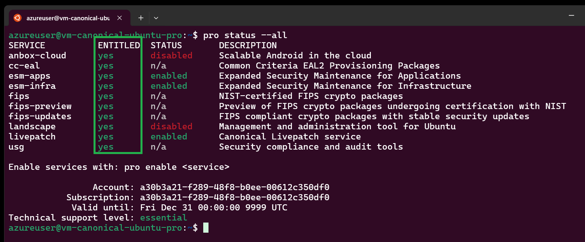

# Azure Hardened Images

Testing hardened images options on Azure.

## Setup

Start by creating the temporary keys for SSH authentication:

```sh
mkdir .keys && ssh-keygen -f .keys/tmp_rsa
```

Copy the variables file:

```sh
cp templates/local.auto.tfvars .auto.tfvars
```

Set the required values:

```terraform
subscription_id    = ""
allowed_public_ips = [""]
```

> [!NOTE]
> For some images, you must accept the terms for marketplace images. Check in the sections bellow for reference.

Adjust the images available by commenting/uncommenting the code blocks referring to the different image types. Options explained here are:

- CIS Ubuntu
- Canonical Ubuntu Pro

Make sure the terms have been accepted for required images before proceeding.

Create the infrastructure:

```sh
terraform init
terraform apply -auto-approve
```

## Center for Internet Security (CIS)

### Introduction

Check the [CIS Hardened Images on Microsoft Azure][1] for more information from CIS.

Form the Azure Marketplace image Ubuntu Linux Server LTS, visit the page at [CIS Hardened Images on Ubuntu Linux Server LTS][2].

CIS also provides STIG-compliant images, with additional information at the [CIS Cloud Security Resources for STIG Compliance][1].


### Accept the Terms

```sh
# Try with latest tag
az vm image terms accept --urn "center-for-internet-security-inc:cis-ubuntu:cis-ubuntulinux2404-l1-gen2:latest"

# If not present, use explicit version
az vm image terms accept --urn "center-for-internet-security-inc:cis-ubuntu:cis-ubuntulinux2404-l1-gen2:1.0.1"
```

### Check for Updates

```sh
az vm image list -p center-for-internet-security-inc -f cis-ubuntu -s cis-ubuntulinux2404-l1-gen2 --all
```

## Canonical Ubuntu Pro

Information about Canonical Ubuntu Pro images can be found at [About Public Cloud Ubuntu Pro images][4].

And the Azure Marketplace options can be found at [Ubuntu 24.04 LTS - all plans including Ubuntu Pro][5].

This video from [Canonical](https://youtu.be/y5WK3y4BnzM) gives a good explanation about Ubuntu Pro on Azure.

### Accept the Terms

```sh
# Ubuntu 22
az vm image terms accept --urn "canonical:0001-com-ubuntu-pro-jammy:pro-22_04-lts-gen2:latest"
```

### Service management

To check the service status of Ubuntu Pro:

> [!TIP]
> Read the full documentation in the [Ubuntu Pro Client][8] hot site.

```sh
sudo ua status --wait
```

To check Livepatch:

```sh
canonical-livepatch status --verbose
```

### Check for Updates

```sh
az vm image list -p center-for-internet-security-inc -f cis-ubuntu -s cis-ubuntulinux2404-l1-gen2 --all
```

## Extracting reports

A storage account has been provisioned and the Azure CLI should be available.

Login to Azure CLI with the VM identity:

```sh
# Make sure to use "sudo"
sudo az login --identity
```

If using Ubuntu Pro, make sure that the client is up to date:

```sh
sudo apt update && sudo apt install ubuntu-advantage-tools
```

As we can see, this image is entitled for all services, and has an `essential` support level:

```sh
pro status --all
```



Enable and install USG:

> [!NOTE]
> As of the time of this writing, USG is not available for Ubuntu Server 24.04.

```sh
sudo pro enable usg
sudo apt install usg
```

The [profile options][9] for server are:

- `cis_level1_server`
- `cis_level2_server`

Audit to verify current status:

```sh
sudo usg audit <PROFILE>
```

Apply the fixes:

> [!NOTE]
> A system reboot is required to complete the fix process. Run `usg audit` after teh reboot.

```sh
sudo usg fix <PROFILE>
```

To upload the reports to the blob storage:

```sh
sudo az storage blob upload \
    --account-name <storage-account> \
    --container-name blobs \
    --name myFile.txt \
    --file myFile.txt \
    --auth-mode login
```

Results running Lynis on a CIS Level 1:

```
  Lynis security scan details:

  Hardening index : 68 [#############       ]
  Tests performed : 261
  Plugins enabled : 1
```

Results running Lynis on a CIS Level 2:

```
Lynis security scan details:

  Hardening index : 70 [##############      ]
  Tests performed : 264
  Plugins enabled : 1
```

After upgrading all packages on a CIS Level 2:

```
Lynis security scan details:

  Hardening index : 75 [###############     ]
  Tests performed : 264
  Plugins enabled : 1
```

## Pricing

### CIS

As of this writing and marketplace documentation, this is the pricing estimate. This is additional costs on top of standard VM and disk resources. This [video][6] does a walkthrough.

> [!NOTE]
> When creating a VM using the portal, the estimate monthly costs provided by Azure is different. For example, it says CIS image license would cost $89.35 monthly.


| Image      | Architectures | $/Hour  | Monthly | 1-Year |
|------------|---------------|--------|---------|--------|
| CIS        | x86           | $0.0225 | $16.42  | $197.1 | 

### Ubuntu Pro

Ubuntu Pro licenses are charged according to Canonical [pricing table][7], but offer a variety of additional features, one of which is hardening.


## Compliance Check

Here are some of the tools that can be used to verify the compliance of images with baselines:

### OpenSCAP

https://www.open-scap.org/

```sh
sudo apt install -y openscap-scanner
```

Get the content:

```sh
git clone https://github.com/ComplianceAsCode/content.git
cd content/build
sudo apt install -y cmake libxml2-utils xsltproc
cmake ..
make -j$(nproc)
```

To run the scan:

```sh
cd ../..
oscap xccdf eval --profile xccdf_org.ssgproject.content_profile_cis --results scan-results.xml --report scan-report.html ./content/build/ssg-ubuntu2404-ds.xml
```

### Lynis

https://cisofy.com/lynis/

```sh
sudo apt install -y lynis
sudo lynis audit system
```

Running the scan on a Ubuntu Server box:

```
  Hardening index : 64 [############        ]
  Tests performed : 254
  Plugins enabled : 1
```

The results for a CIS image are the following:

```
  Hardening index : 72 [##############      ]
  Tests performed : 254
  Plugins enabled : 1
```

### CIS-CAT Lite

https://learn.cisecurity.org/cis-cat-lite


### DevSec Hardening

https://github.com/dev-sec

### Compliance-as-code

https://github.com/ComplianceAsCode/content

[1]: https://www.cisecurity.org/cis-hardened-images/microsoft
[2]: https://azuremarketplace.microsoft.com/en-us/marketplace/apps/center-for-internet-security-inc.cis-ubuntu?tab=Overview
[3]: https://www.cisecurity.org/insights/blog/new-options-from-cis-for-stig-compliance
[4]: https://canonical-ubuntu-pro-client.readthedocs-hosted.com/en/v29/explanations/what_are_ubuntu_pro_cloud_instances.html
[5]: https://azuremarketplace.microsoft.com/en-us/marketplace/apps/canonical.ubuntu-24_04-lts?tab=Overview
[6]: https://www.youtube.com/watch?v=BuOa8AAPWwM
[7]: https://ubuntu.com/pricing/pro
[8]: https://canonical-ubuntu-pro-client.readthedocs-hosted.com/en/latest/index.html
[9]: https://ubuntu.com/security/certifications/docs/usg/cis/compliance
